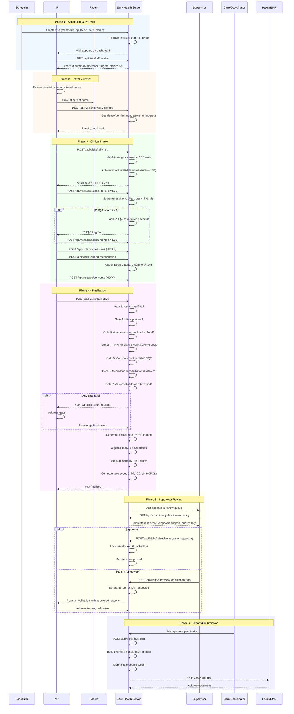
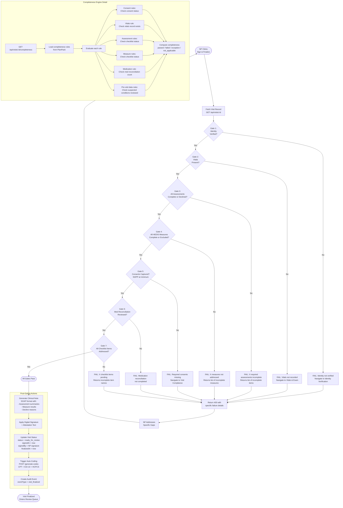
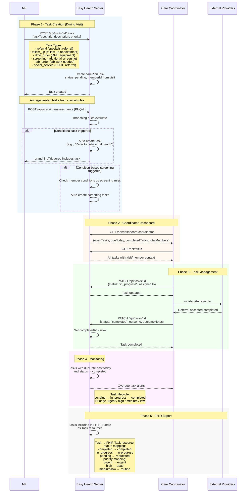
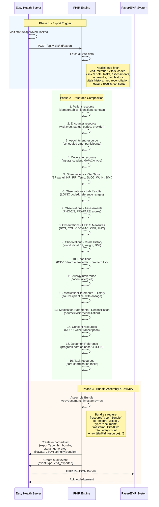
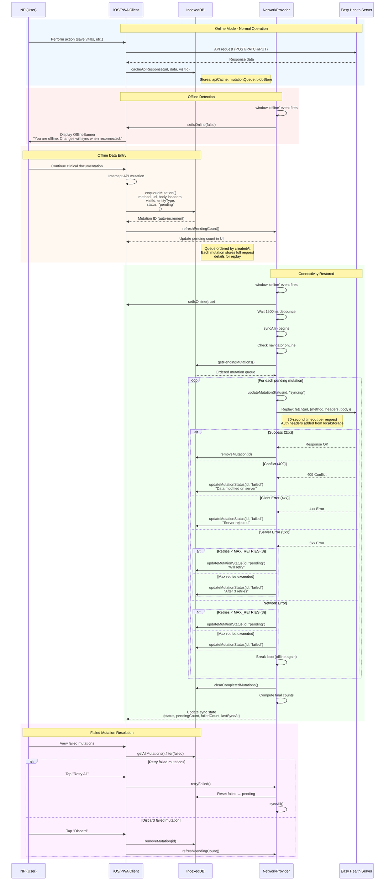

# Easy Health Clinical Platform - Technical Activity Diagrams

## How to Read These Diagrams

This document provides comprehensive activity and sequence diagrams for every major workflow in the Easy Health in-home NP visit platform. Each diagram uses [Mermaid](https://mermaid.js.org/) syntax and can be rendered in any Mermaid-compatible viewer (GitHub, VS Code, etc.).

### Diagram Conventions

- **Sequence Diagrams** (`sequenceDiagram`): Used for inter-system flows where the order of messages between actors matters. Arrows show request/response pairs, and `alt`/`opt` blocks show conditional logic.
- **Flowchart Diagrams** (`flowchart TD`): Used for decision-heavy workflows where branching logic is the primary concern. Diamond shapes represent decisions, rectangles represent actions.
- **Actors/Participants**: Each named participant represents either a human role or a system component. Solid arrows indicate synchronous calls; dashed arrows indicate responses or asynchronous events.
- **Color coding in flowcharts**: Subgraphs group related steps by domain (clinical, technical, compliance).

### System Actors

| Actor | Description |
|---|---|
| **NP** | Nurse Practitioner - conducts in-home visits, records clinical data |
| **Patient** | Medicare Advantage / ACA plan member receiving care |
| **Supervisor** | Physician (MD/DO) who reviews and adjudicates NP-submitted visits |
| **Care Coordinator** | Manages post-visit follow-up tasks, referrals, DME orders |
| **Admin** | System administrator configuring security, AI providers, plan packs |
| **Compliance Officer** | Audits visit documentation for RADV/NCQA compliance |
| **Easy Health Server** | Node.js/Express backend with PostgreSQL persistence |
| **Azure AI Services** | Azure Speech SDK (transcription) and Azure OpenAI / OpenAI (extraction) |
| **HIE** | Health Information Exchange - external FHIR-based clinical data source |
| **Payer/EMR System** | Insurance plan or electronic medical record receiving FHIR bundles |
| **iOS/PWA Client** | Capacitor-based iOS app or Progressive Web App running in browser |

---

## 1. Complete Visit Lifecycle

### Business Context

The complete visit lifecycle represents the end-to-end journey of an in-home clinical encounter, from scheduling through payer submission. Every step exists for a specific regulatory, clinical, or billing reason mandated by CMS (Centers for Medicare & Medicaid Services), NCQA (National Committee for Quality Assurance), or state nursing practice acts.

Medicare Advantage and ACA plans require comprehensive documentation to support risk adjustment (HCC coding), HEDIS quality measure reporting, and RADV (Risk Adjustment Data Validation) audits. Each phase of the visit lifecycle produces artifacts that must be traceable, complete, and clinically accurate. The gating validation at finalization ensures that no visit reaches a supervisor or payer without meeting minimum documentation thresholds.

The lifecycle also enforces a separation of duties required by compliance frameworks: the NP documents, a supervisor reviews and attests, and only then can data be exported. This chain of custody protects against billing fraud, supports malpractice defense, and ensures clinical quality.

### Handoff Details

| # | From | To | Business Purpose | Technical Implementation |
|---|---|---|---|---|
| 1 | Scheduler | Server | Assign NP to member visit per plan requirements | `POST /api/visits` with memberId, npUserId, planId |
| 2 | Server | NP | Pre-visit intelligence for clinical preparation | `GET /api/visits/:id/bundle` returns member, targets, planPack |
| 3 | NP | Server | Legal patient identification (CMS requirement) | `POST /api/visits/:id/verify-identity` sets identityVerified=true |
| 4 | NP | Server | Clinical data capture at point of care | Multiple POST endpoints for vitals, assessments, measures |
| 5 | Server | Server | Ensure documentation completeness before sign-off | 7-gate validation in `/api/visits/:id/finalize` |
| 6 | NP | Server | Legal attestation and digital signature | Signature + attestation text stored on visit record |
| 7 | Server | Supervisor | Separation of duties - physician oversight | Visit enters review queue with status=ready_for_review |
| 8 | Supervisor | Server | Clinical quality assurance decision | `POST /api/visits/:id/review` with decision, comments |
| 9 | Server | Payer | Claims submission and quality reporting | `POST /api/visits/:id/export` generates FHIR Bundle |

### Architecture Decision Record

| Decision | Rationale |
|---|---|
| **7-gate finalization** | Prevents incomplete visits from reaching supervisors, reducing rework cycles and ensuring billing compliance |
| **Status-based workflow** | `scheduled → in_progress → ready_for_review → approved → exported` provides clear audit trail and prevents out-of-order operations |
| **Visit locking on approval** | Once supervisor approves, `lockedAt`/`lockedBy` fields prevent any modification, preserving legal integrity |
| **Auto-coding at finalization** | Generates CPT/ICD-10/HCPCS codes based on documented evidence, reducing manual coding errors |
| **SOAP-format clinical note** | Industry-standard documentation format expected by payers and required for RADV audits |

### Error Recovery

| Failure | Recovery |
|---|---|
| Gate validation fails | Server returns specific failure reasons with remediation links; NP addresses gaps and re-attempts |
| Finalization server error | Visit remains in `in_progress` status; NP can retry without data loss |
| Supervisor review system error | Review decision is atomic; partial failures roll back; visit remains in `ready_for_review` |
| Export failure | Export artifact stored with status=failed; can be regenerated from visit data at any time |

---

## 2. Clinical Intake Workflow (Detail)

### Business Context

The clinical intake workflow represents the core data capture during an in-home NP visit. This workflow must balance clinical thoroughness with NP efficiency - visits are time-constrained (typically 45-60 minutes) and NPs carry heavy caseloads. Every data element captured serves at least one of three purposes: direct patient care, quality measure reporting (HEDIS), or risk adjustment coding (HCC).

The workflow incorporates Clinical Decision Support (CDS) at multiple points, evaluating real-time rules against entered data. For example, elevated blood pressure triggers a hypertension management alert, and a PHQ-2 depression screening score of 3 or higher automatically triggers the more detailed PHQ-9 assessment. These branching rules are driven by CMS and NCQA requirements - a plan cannot claim credit for a depression screening measure if an elevated PHQ-2 is not followed by a PHQ-9.

The auto-coding engine runs after finalization to generate appropriate billing codes. CPT codes capture the visit type and complexity, ICD-10 codes capture diagnoses supported by clinical evidence, and HCPCS codes capture specific quality measures. Each code must have supporting evidence mapped back to clinical documentation to withstand RADV audits.

```mermaid
flowchart TD
    Start([NP Opens Visit]) --> IDCheck{Identity<br/>Verified?}
    IDCheck -->|No| VerifyID[Verify Patient Identity<br/>Photo ID / Knowledge-Based]
    VerifyID --> IDConfirm[POST /verify-identity<br/>identityVerified=true]
    IDConfirm --> VitalsEntry
    IDCheck -->|Yes| VitalsEntry

    subgraph Vitals [Vitals & Physical Exam]
        VitalsEntry[Enter Vital Signs<br/>BP, HR, RR, Temp, SpO2, Weight, Height]
        VitalsEntry --> VitalsValidate{Vitals in<br/>Valid Range?}
        VitalsValidate -->|Warnings| VitalsWarn[Display CDS Alerts<br/>Out-of-range warnings]
        VitalsWarn --> VitalsOverride{NP Override<br/>with Reason?}
        VitalsOverride -->|Yes| SaveOverride[Store ValidationOverride<br/>field, reason, note]
        VitalsOverride -->|No| VitalsEntry
        VitalsValidate -->|Valid| SaveVitals[POST /vitals<br/>Save + sync to history]
        SaveOverride --> SaveVitals
    end

    SaveVitals --> CDSEval[Evaluate CDS Rules<br/>POST /evaluate-rules<br/>source=vitals]
    CDSEval --> CDSAlerts{CDS Alerts<br/>Triggered?}
    CDSAlerts -->|Yes| ShowAlerts[Display Recommendations<br/>Hypertension, Fall Risk, etc.]
    CDSAlerts -->|No| AutoMeasure
    ShowAlerts --> AutoMeasure

    AutoMeasure[Auto-Evaluate Vitals Measures<br/>e.g., CBP from BP readings] --> PhysicalExam

    PhysicalExam[Physical Examination<br/>Document exam findings] --> Assessments

    subgraph Assessments [Standardized Assessments]
        AssessStart[Load Required Assessments<br/>from PlanPack checklist]
        AssessStart --> PHQ2[Administer PHQ-2<br/>Depression Screening]
        PHQ2 --> PHQ2Score{PHQ-2<br/>Score >= 3?}
        PHQ2Score -->|Yes| PHQ9[Trigger PHQ-9<br/>Add to checklist dynamically]
        PHQ9 --> PHQ9Complete[Complete PHQ-9<br/>Full depression assessment]
        PHQ2Score -->|No| PRAPARE
        PHQ9Complete --> PRAPARE
        PRAPARE[Administer PRAPARE<br/>Social Determinants Screening]
        PRAPARE --> FallRisk[Fall Risk Assessment<br/>if applicable]
        FallRisk --> AssessDecline{Unable to<br/>Assess?}
        AssessDecline -->|Yes| DeclineReason[Record Decline Reason<br/>status=unable_to_assess]
        AssessDecline -->|No| AssessComplete[Mark Assessment Complete<br/>Update checklist item]
    end

    DeclineReason --> HEDISMeasures
    AssessComplete --> HEDISMeasures

    subgraph HEDIS [HEDIS Quality Measures]
        HEDISStart[Load Required Measures<br/>BCS, COL, CDC-A1C, CBP, FMC]
        HEDISStart --> MeasureCapture[Capture Measure Evidence<br/>Multiple capture methods]
        MeasureCapture --> MeasureExclude{Exclude<br/>Measure?}
        MeasureExclude -->|Yes| ExcludeReason[Record Exclusion<br/>with structured reason]
        MeasureExclude -->|No| MeasureComplete[Mark Measure Complete<br/>captureMethod + evidence]
    end

    ExcludeReason --> MedRecon
    MeasureComplete --> MedRecon

    subgraph MedRecon [Medication Reconciliation]
        MedStart[Load Current Medications<br/>from member + HIE]
        MedStart --> MedReview[Review Each Medication<br/>Verify dosage, frequency]
        MedReview --> BeersCheck{Beers Criteria<br/>Flag?}
        BeersCheck -->|Yes| BeersAlert[Display Beers Risk Alert<br/>isBeersRisk=true]
        BeersCheck -->|No| InteractionCheck
        BeersAlert --> InteractionCheck
        InteractionCheck{Drug<br/>Interactions?}
        InteractionCheck -->|Yes| InteractionAlert[Display Interaction Flags<br/>interactionFlags array]
        InteractionCheck -->|No| MedSave
        InteractionAlert --> MedSave
        MedSave[Save Reconciliation<br/>status: verified/new/modified/discontinued]
    end

    MedSave --> ProgressNote[Generate Progress Note<br/>MEAT/TAMPER compliant<br/>SOAP format]
    ProgressNote --> Completeness[Check Completeness<br/>GET /completeness]
    Completeness --> AllDone{All Items<br/>Complete?}
    AllDone -->|No| ShowGaps[Display Missing Items<br/>with remediation links]
    ShowGaps --> Assessments
    AllDone -->|Yes| ReadyFinalize[Ready for Finalization]
    ReadyFinalize --> AutoCode[POST /generate-codes<br/>CPT + ICD-10 + HCPCS]
    AutoCode --> FinalizeReady([Visit Ready to Finalize])
```

### Handoff Details

| # | From | To | Business Purpose | Technical Implementation |
|---|---|---|---|---|
| 1 | NP | Vitals Engine | Record objective clinical measurements | `POST /api/visits/:id/vitals` with range validation |
| 2 | Vitals Engine | CDS Engine | Evaluate clinical decision rules against vitals | `POST /api/visits/:id/evaluate-rules` with source=vitals |
| 3 | CDS Engine | NP | Alert NP to clinically significant findings | Returns triggered recommendations with severity and action |
| 4 | NP | Assessment Engine | Capture standardized screening responses | `POST /api/visits/:id/assessments` with scoring |
| 5 | Assessment Engine | Branching Logic | Evaluate if follow-up assessments are needed | `branchingRules.followUpAssessments` with score threshold check |
| 6 | NP | HEDIS Engine | Document quality measure evidence | `POST /api/visits/:id/measures` with evidence metadata |
| 7 | NP | Med Recon Engine | Reconcile patient medications | `POST /api/visits/:id/med-reconciliation` with Beers/interaction flags |
| 8 | Server | Auto-Coder | Generate billing codes from clinical evidence | `POST /api/visits/:id/generate-codes` maps evidence to CPT/ICD/HCPCS |

### Architecture Decision Record

| Decision | Rationale |
|---|---|
| **PHQ-2 → PHQ-9 branching** | NCQA requires PHQ-9 follow-up when PHQ-2 >= 3; implemented as dynamic checklist insertion via `branchingRules` |
| **Validation override with reason** | NPs may encounter legitimate out-of-range values (e.g., marathon runner with HR 45); override creates audit trail |
| **Auto-evaluate vitals measures** | CBP (Controlling Blood Pressure) can be immediately evaluated from BP readings, reducing NP manual steps |
| **Structured decline reasons** | Using `EXCLUSION_REASONS` enum ensures standardized documentation for measures that cannot be completed |
| **Evidence-mapped auto-coding** | Each generated code references its triggering evidence (vitals, assessment, measure) for RADV traceability |

### Error Recovery

| Failure | Recovery |
|---|---|
| Vitals save fails | Client-side validation prevents invalid data; server returns specific field errors; data not lost in form |
| CDS rule evaluation error | Logged but non-blocking; visit continues without alerts; rules re-evaluated on next data save |
| Assessment branching failure | Logged; PHQ-9 can be manually added; assessment completion still tracked independently |
| Auto-coding error | Non-blocking; codes can be manually generated later; visit finalization not dependent on auto-coding |

---

## 3. Voice Capture & AI Pipeline

### Business Context

Voice capture exists to address a fundamental efficiency challenge in home health: NPs spend significant time manually entering clinical data during visits, which reduces face time with patients and increases documentation burden. By allowing NPs to narrate clinical findings while examining the patient, the platform can capture richer clinical detail while improving the patient experience.

The voice pipeline must navigate several compliance requirements. Patient consent for voice recording is mandatory before any recording begins - this is enforced as a hard gate in the UI and server. The AI provider configuration is admin-controlled, allowing organizations to choose between Azure Speech Services and OpenAI Whisper based on their BAA (Business Associate Agreement) requirements. All AI processing occurs server-side to maintain HIPAA compliance; no audio data is processed on-device.

The extraction pipeline uses GPT-4o (or configured alternative) to parse transcribed text into structured clinical fields (vitals, conditions, screenings). These extracted fields are presented to the NP for review before being applied to the visit - the system never auto-applies AI-extracted data without clinician confirmation, maintaining the principle of clinician oversight over AI-assisted documentation.

```mermaid
sequenceDiagram
    participant NP
    participant Client as iOS/PWA Client
    participant Server as Easy Health Server
    participant AI as Azure AI / OpenAI

    rect rgb(255, 245, 245)
    Note over NP, Client: Consent & Configuration Gates
    NP->>Client: Open Voice Capture
    Client->>Server: GET /api/visits/:id/consents
    Server-->>Client: Consent list

    alt Voice consent not granted
        Client-->>NP: "Voice consent required" - blocked
        NP->>Client: Navigate to Consents
        NP->>Server: POST /api/visits/:id/consents<br/>(voice_transcription, granted)
        Server-->>Client: Consent recorded
    end

    Client->>Server: GET /api/ai-providers/active
    Server-->>Client: {configured, hasKey, provider}

    alt AI provider not configured or no key
        Client-->>NP: "AI provider not configured" - blocked
    end
    end

    rect rgb(240, 255, 240)
    Note over NP, Client: Audio Recording
    NP->>Client: Tap "Start Recording"
    Client->>Client: getSupportedAudioMimeType()
    Note right of Client: Priority: webm/opus > webm ><br/>mp4 > mp4/aac > ogg/opus > aac
    Client->>Client: navigator.mediaDevices.getUserMedia({audio})
    Client->>Client: new MediaRecorder(stream, {mimeType})
    Client->>Client: recorder.start(1000) - 1s chunks
    Client-->>NP: Recording indicator + elapsed timer

    opt Pause/Resume
        NP->>Client: Tap Pause
        Client->>Client: recorder.pause()
        NP->>Client: Tap Resume
        Client->>Client: recorder.resume()
    end

    NP->>Client: Tap "Stop & Save"
    Client->>Client: recorder.stop()
    Client->>Client: Blob from chunks<br/>getAudioBlobType(mimeType)
    Client->>Client: FileReader.readAsDataURL() -> base64
    end

    rect rgb(240, 240, 255)
    Note over Client, AI: Upload & Transcription
    Client->>Server: POST /api/visits/:id/recordings<br/>{audioData: base64, mimeType, durationSec}
    Server->>Server: Store recording in DB
    Server-->>Client: Recording ID

    Client->>Server: POST /api/visits/:id/transcribe<br/>{recordingId}
    Server->>Server: Create transcript record (status=processing)
    Server->>Server: Decode base64 audio

    alt Azure Speech Provider
        Server->>Server: ffmpeg convert to 16kHz WAV
        Server->>AI: Azure Speech SDK recognizeOnceAsync()
        AI-->>Server: Transcribed text
    else OpenAI Whisper Provider
        Server->>AI: POST /v1/audio/transcriptions<br/>model=whisper-1
        AI-->>Server: Transcribed text
    else Azure OpenAI Whisper
        Server->>AI: POST /openai/deployments/whisper/audio/transcriptions
        AI-->>Server: Transcribed text
    end

    Server->>Server: Update transcript (text, status=completed)
    Server->>Server: Update recording (status=transcribed)
    Server-->>Client: Transcript with text
    end

    rect rgb(255, 255, 240)
    Note over Client, AI: Field Extraction
    Client->>Server: POST /api/visits/:id/extract<br/>{transcriptId}

    alt Azure OpenAI
        Server->>AI: Chat completion with extraction prompt<br/>response_format: json_object
    else OpenAI
        Server->>AI: GPT-4o chat completion<br/>Structured extraction prompt
    else Anthropic
        Server->>AI: Claude messages API<br/>Extraction prompt
    end

    AI-->>Server: JSON array of extracted fields

    alt AI returns 0 fields
        Server->>Server: fallbackExtractFields(text)<br/>Regex-based extraction
    end

    Server->>Server: Store extracted fields<br/>(status=pending, per field)
    Server-->>Client: {fields, count}
    end

    rect rgb(248, 248, 248)
    Note over NP, Server: Review & Apply
    NP->>Client: Review extracted fields
    NP->>Client: Accept/Reject individual fields
    NP->>Server: POST /api/visits/:id/extracted-fields/bulk-accept
    Server->>Server: Apply accepted fields to visit data
    Server-->>NP: Fields applied to vitals/assessments
    end
```

### Handoff Details

| # | From | To | Business Purpose | Technical Implementation |
|---|---|---|---|---|
| 1 | Client | Server | Consent verification before recording | `GET /api/visits/:id/consents` checks voice_transcription consent |
| 2 | Client | Server | AI provider availability check | `GET /api/ai-providers/active` returns configured status and key availability |
| 3 | Client | Client | Browser MIME type negotiation for cross-platform audio | `getSupportedAudioMimeType()` tests candidates in priority order |
| 4 | Client | Server | Upload encoded audio for server-side processing | `POST /api/visits/:id/recordings` with base64 audio payload |
| 5 | Server | Azure/OpenAI | Speech-to-text transcription | Provider-specific API: Azure Speech SDK or OpenAI Whisper |
| 6 | Server | Azure/OpenAI | NLP extraction of structured clinical fields | GPT-4o with clinical extraction prompt returning JSON |
| 7 | NP | Server | Clinician review and approval of AI suggestions | Bulk accept endpoint applies reviewed fields to visit data |

### Architecture Decision Record

| Decision | Rationale |
|---|---|
| **Consent as hard gate** | HIPAA and state laws require explicit patient consent for voice recording; enforced at both UI and API level |
| **Server-side AI processing** | Audio never processed on-device; all PHI remains within HIPAA-compliant server boundary |
| **Base64 upload** | Avoids multipart form complexity on Capacitor/iOS; audio files are typically <5MB for visit-length recordings |
| **MIME type detection** | iOS Safari supports mp4/aac but not webm; Chrome supports webm/opus; detection ensures cross-platform compatibility |
| **Fallback regex extraction** | If AI returns 0 fields, server falls back to regex patterns for common clinical values (BP, HR, weight, etc.) |
| **Pending status for extracted fields** | AI suggestions are never auto-applied; NP must review and accept each field, maintaining clinician oversight |
| **Multi-provider support** | Organizations may have different BAA arrangements; configurable provider (Azure Speech, OpenAI, Anthropic) per deployment |

### Error Recovery

| Failure | Recovery |
|---|---|
| Microphone access denied | Toast notification with instructions to enable in device settings |
| Recording format not supported | Falls through MIME type candidates; empty string triggers browser default |
| Upload fails (network) | Audio blob retained in client memory; mutation queued for offline sync |
| Transcription API error | Transcript record created with status=error and errorMessage; NP can retry |
| Extraction returns invalid JSON | Server returns 502; NP can re-trigger extraction or enter data manually |
| AI returns 0 fields | Automatic fallback to regex-based extraction; captures common vitals patterns |

---

## 4. Authentication & MFA Flow

### Business Context

Healthcare applications require robust authentication to protect PHI (Protected Health Information) under HIPAA. The Easy Health platform implements a layered security model: username/password as the primary factor, configurable MFA (Multi-Factor Authentication) as the second factor, and optional biometric gating (Face ID/Touch ID) on iOS devices. These layers are required by most Medicare Advantage plan security assessments.

MFA is admin-configurable because different deployment contexts have different security requirements. A production deployment handling live PHI would require MFA for all clinical roles, while a demo environment might bypass MFA for ease of use. The role-based bypass mechanism allows admins to exempt certain roles (e.g., demo users) while maintaining MFA for clinical and administrative roles.

Session management includes automatic timeout and lock mechanisms. After a configurable period of inactivity (default 30 minutes), the session locks - requiring password re-entry (or biometric verification on iOS) to resume. This prevents unauthorized access when an NP leaves their device unattended during a home visit.

```mermaid
sequenceDiagram
    participant User
    participant Client as iOS/PWA Client
    participant Server as Easy Health Server
    participant Store as Session Store

    rect rgb(240, 248, 255)
    Note over User, Server: Primary Authentication
    User->>Client: Enter username + password
    Client->>Server: POST /api/auth/login<br/>{username, password}
    Server->>Server: Lookup user by username
    Server->>Server: Validate password

    alt Invalid credentials
        Server-->>Client: 401 "Invalid credentials"
        Client-->>User: Error message
    end
    end

    rect rgb(255, 248, 240)
    Note over Server, Store: MFA Decision
    Server->>Server: GET security settings
    Server->>Server: Check mfaRequired flag

    alt MFA required AND user role not in bypassRoles
        Server->>Server: Generate 6-digit OTP
        Server->>Server: Store MFA code with TTL<br/>(default 300s) + maxAttempts (default 5)
        Server->>Server: Log: "[MFA] Code for user: XXXXXX"
        Server-->>Client: {mfaRequired: true, userId, maskedPhone: "***1234"}

        User->>Client: Enter 6-digit code
        Client->>Server: POST /api/auth/verify-mfa<br/>{userId, code}

        alt Too many attempts (>= maxAttempts)
            Server-->>Client: 429 "Too many attempts"
        end

        alt Code expired (past TTL)
            Server-->>Client: 400 "Code expired"
            User->>Client: Request new code
            Client->>Server: POST /api/auth/resend-mfa<br/>{userId}
            Server->>Server: Generate new OTP with fresh TTL
            Server-->>Client: "New code sent to ***1234"
        end

        alt Code already used
            Server-->>Client: 400 "Code already used"
        end

        alt Incorrect code
            Server->>Server: Increment attempts counter
            Server-->>Client: 401 "Invalid verification code"
        end

        Server->>Server: Mark MFA code as verified
        Server->>Server: Fetch user record
        Server-->>Client: User object (sans password)

    else MFA not required OR role bypassed
        Server-->>Client: User object (sans password)
    end
    end

    rect rgb(240, 255, 240)
    Note over Client, Store: Session Establishment
    Client->>Store: localStorage.setItem("feh_user", user)
    Client->>Client: Initialize AuthProvider context
    Client->>Client: Start session timeout timer<br/>(sessionTimeoutMinutes from settings)
    end

    rect rgb(255, 240, 255)
    Note over User, Client: Session Lifecycle
    loop Every user interaction
        Client->>Client: Reset inactivity timer
    end

    alt Inactivity exceeds timeout
        Client->>Client: Show SessionLockScreen
        Client-->>User: "Session locked due to inactivity"

        User->>Client: Enter password to unlock
        Client->>Server: POST /api/auth/unlock<br/>{username, password}

        alt Invalid password
            Server-->>Client: 401 "Invalid password"
        end

        Server-->>Client: User object (verified)
        Client->>Client: Dismiss lock screen, resume session
    end
    end

    rect rgb(248, 248, 240)
    Note over User, Client: iOS Biometric Gate (Optional)
    opt biometricRequired in security settings
        Client->>Client: Check biometric availability<br/>(Face ID / Touch ID)
        Client->>User: Prompt biometric authentication
        alt Biometric success
            Client->>Client: Proceed to app
        else Biometric failure
            Client-->>User: "Biometric verification failed"
            Client->>Client: Fall back to password entry
        end
    end
    end
```

### Handoff Details

| # | From | To | Business Purpose | Technical Implementation |
|---|---|---|---|---|
| 1 | User | Server | Primary identity verification | `POST /api/auth/login` - username/password validation |
| 2 | Server | Store | Persist MFA code with expiration | MFA code stored via `storage.createMfaCode()` with TTL |
| 3 | User | Server | Second factor verification | `POST /api/auth/verify-mfa` - OTP validation with attempt tracking |
| 4 | Client | Store | Session persistence across page refreshes | `localStorage.setItem("feh_user", JSON.stringify(user))` |
| 5 | Client | Client | Inactivity detection and session locking | Timer-based monitoring with configurable timeout |
| 6 | User | Server | Re-authentication after session lock | `POST /api/auth/unlock` - password re-validation |
| 7 | Client | Client | Biometric verification on iOS | Native Capacitor biometric plugin (Face ID/Touch ID) |

### Architecture Decision Record

| Decision | Rationale |
|---|---|
| **Admin-configurable MFA** | Different deployments have different security requirements; `securitySettings` table controls MFA policy |
| **Role-based MFA bypass** | `bypassRoles` array allows exempting specific roles from MFA (e.g., demo environments) |
| **6-digit numeric OTP** | Standard MFA code format; TTL (default 300s) and max attempts (default 5) prevent brute force |
| **Server-side password storage** | Passwords stored directly (demo context); production would use bcrypt/argon2 hashing |
| **Client-side session timeout** | Prevents unauthorized access from unattended devices; critical for in-home visit context |
| **Biometric as optional gate** | iOS devices support Face ID/Touch ID; configurable per security policy; fallback to password always available |

### Error Recovery

| Failure | Recovery |
|---|---|
| MFA code expired | User can request resend via `/api/auth/resend-mfa`; new code generated with fresh TTL |
| Too many MFA attempts | User must request new code; previous code invalidated |
| Session timeout during data entry | Session locks but does not destroy; data in forms preserved; unlock resumes session |
| Biometric unavailable | Automatic fallback to password-based authentication |
| Network error during login | Client-side error display; retry available immediately |

---

## 5. HIE Pre-Visit Intelligence Ingestion

### Business Context

Health Information Exchange (HIE) integration addresses a critical gap in home health care: NPs visiting patients at home typically lack access to the patient's complete medical record. Without HIE data, NPs risk duplicating tests already performed by other providers, missing important diagnoses, and failing to close quality measure gaps that have existing evidence in the broader healthcare system.

The HIE ingestion pipeline receives FHIR R4 PrevisitContext bundles containing the patient's recent medical history from external healthcare systems. This includes medications, conditions, lab results, vital signs, and procedures. Each resource is tagged with provenance metadata (source: "hie") to maintain clear data lineage - the system always knows which data came from HIE versus data captured during the current visit. This provenance tracking is critical for RADV audits where the source of every clinical assertion must be traceable.

The suspected conditions workflow is particularly important for risk adjustment. HIE conditions are presented as "suspected" rather than "confirmed" because the NP must clinically validate each condition during the in-person visit. Confirmed conditions become visit diagnoses with ICD-10 codes; dismissed conditions are documented with a reason. This workflow directly impacts HCC (Hierarchical Condition Category) coding accuracy and supports the plan's risk adjustment submissions.

```mermaid
sequenceDiagram
    participant HIE as HIE System
    participant Server as Easy Health Server
    participant NP
    participant Supervisor

    rect rgb(240, 248, 255)
    Note over HIE, Server: Phase 1 - Bundle Ingestion
    HIE->>Server: POST /api/fhir/previsit/:visitId<br/>FHIR Bundle (PrevisitContext)
    Server->>Server: Validate bundle structure<br/>Check resourceType=Bundle
    Server->>Server: Create ingestion log<br/>{visitId, sourceSystem, status=processing}
    Server->>Server: Count resources by type<br/>(resourceSummary map)
    end

    rect rgb(240, 255, 240)
    Note over Server, Server: Phase 2 - Resource Processing
    loop For each bundle entry
        alt MedicationStatement
            Server->>Server: Extract medication details<br/>(name, dosage, frequency, route)
            Server->>Server: Check for duplicate medication
            Server->>Server: Create medReconciliation entry<br/>source="external", status="new"
            Server->>Server: Tag provenance: source=hie
        else Condition
            Server->>Server: Extract ICD-10 code + description
            Server->>Server: Check for duplicate condition
            Server->>Server: Create suspectedCondition<br/>status="pending", hieSource=sourceSystem
            Server->>Server: Set confidence from HIE data
        else Observation (Lab/Vitals)
            alt Laboratory
                Server->>Server: Extract lab result data
                Server->>Server: Create labResult<br/>source="hie"
            else Vital Signs
                Server->>Server: Extract vital measurements
                Server->>Server: Create vitalsHistory<br/>source="hie"
            end
        else Procedure
            Server->>Server: Extract CPT/HCPCS code
            Server->>Server: Check for duplicate code
            Server->>Server: Create visitCode<br/>source="hie", autoAssigned=true
        else Other
            Server->>Server: Log unsupported resource type
        end
    end

    Server->>Server: Update ingestion log<br/>{status, resourceSummary, processedAt}
    Server-->>HIE: OperationOutcome<br/>{created, skipped, errors}
    end

    rect rgb(255, 248, 240)
    Note over NP, Server: Phase 3 - Pre-Visit Review
    NP->>Server: GET /api/visits/:id/previsit-summary
    Server->>Server: Aggregate suspected diagnoses
    Server->>Server: Identify care gaps vs HIE evidence
    Server->>Server: Build NP action items by priority
    Server-->>NP: Pre-visit intelligence package

    Note right of NP: Action Items:<br/>1. High-priority suspected diagnoses<br/>2. HIE medications pending verification<br/>3. HEDIS care gaps with HIE evidence<br/>4. Measures partially met by HIE data
    end

    rect rgb(255, 240, 255)
    Note over NP, Server: Phase 4 - During Visit
    NP->>Server: GET /api/visits/:id/suspected-conditions
    Server-->>NP: List with ingestion log context

    loop For each suspected condition
        alt NP confirms condition
            NP->>Server: PATCH /suspected-conditions/:condId<br/>{action: "confirm"}
            Server->>Server: Create visitCode (ICD-10)<br/>source="hie", verified=true
            Server->>Server: Update suspectedCondition<br/>status="confirmed", linkedCodeId
        else NP dismisses condition
            NP->>Server: PATCH /suspected-conditions/:condId<br/>{action: "dismiss", dismissalReason}
            Server->>Server: Update suspectedCondition<br/>status="dismissed"
        end
    end

    NP->>NP: Verify HIE medications<br/>in med reconciliation
    end

    rect rgb(255, 255, 240)
    Note over Supervisor, Server: Phase 5 - Supervisor Verification
    Supervisor->>Server: GET /api/visits/:id/adjudication-summary
    Server->>Server: Check HIE data availability
    Server->>Server: Count pending suspected conditions
    Server->>Server: Count unverified HIE medications
    Server-->>Supervisor: Adjudication with HIE badges<br/>{hieDataAvailable, suspectedConditionsReviewed,<br/>hieMedReconciliationStatus}

    alt Pending HIE items remain
        Server-->>Supervisor: Quality flag:<br/>"X HIE-suspected conditions not reviewed"
    end
    end

    rect rgb(248, 248, 248)
    Note over Server, Server: Phase 6 - Completeness Integration
    Server->>Server: Completeness engine evaluates<br/>previsit_data rules
    Server->>Server: suspected_conditions: all reviewed?
    Server->>Server: hie_medication_review: all verified?
    Note right of Server: HIE data rules are "not_applicable"<br/>if no HIE data was ingested
    end
```

### Handoff Details

| # | From | To | Business Purpose | Technical Implementation |
|---|---|---|---|---|
| 1 | HIE | Server | Deliver patient's cross-provider medical history | `POST /api/fhir/previsit/:visitId` with FHIR R4 Bundle |
| 2 | Server | Server | Parse and persist each FHIR resource with provenance | Resource-type switch with duplicate detection and source tagging |
| 3 | Server | NP | Pre-visit clinical intelligence briefing | `GET /api/visits/:id/previsit-summary` with prioritized action items |
| 4 | NP | Server | Clinical validation of suspected conditions | `PATCH /api/visits/:id/suspected-conditions/:condId` with confirm/dismiss |
| 5 | Server | Supervisor | HIE data review status in adjudication | `GET /api/visits/:id/adjudication-summary` includes HIE badges and flags |
| 6 | Server | Completeness | HIE-specific completeness rules | `previsit_data` component type in completeness rules |

### Architecture Decision Record

| Decision | Rationale |
|---|---|
| **Provenance tagging (source=hie)** | Every HIE-sourced record tagged for data lineage; critical for RADV audit trail |
| **Suspected vs. confirmed conditions** | NP must clinically validate HIE conditions in-person; prevents coding based solely on external data |
| **Duplicate detection** | Prevents duplicate medications, conditions, and codes when HIE data overlaps with existing records |
| **not_applicable for missing HIE** | Completeness rules for HIE data automatically set to not_applicable if no HIE bundle was ingested |
| **OperationOutcome response** | FHIR-standard response format with created/skipped/error counts for integration monitoring |
| **Care gap prioritization** | Measures sorted by clinical priority (CDC-A1C, CBP highest) and gap status for NP triage |

### Error Recovery

| Failure | Recovery |
|---|---|
| Invalid FHIR bundle structure | 400 response with OperationOutcome; ingestion log created with status=failed |
| Individual resource processing error | Error logged; other resources continue processing; partial status returned |
| Duplicate resource detected | Silently skipped; counted in skip total; no data corruption |
| HIE system unavailable | Visit proceeds without HIE data; pre-visit summary shows hasHieData=false |
| NP skips suspected condition review | Completeness engine flags pending conditions; blocks finalization until reviewed |

---

## 6. Finalization & Gating Validation

### Business Context

Finalization gating is the single most critical quality control point in the visit lifecycle. It represents the moment when an NP attests that their clinical documentation is complete and accurate - a legal declaration that carries malpractice implications. Every gate exists because its absence has caused real-world problems: incomplete visits submitted for billing lead to claim denials, missing consents create HIPAA liability, and undocumented vitals undermine clinical decision-making.

The 7-gate model is derived from CMS Annual Wellness Visit requirements, NCQA HEDIS documentation standards, and malpractice risk mitigation best practices. Each gate is evaluated server-side (not just in the UI) to prevent any bypass through direct API calls. The gates are evaluated atomically - if any gate fails, the entire finalization is rejected with specific failure reasons that guide the NP to the exact missing items.

Upon successful gating, the system generates a SOAP-format clinical note, applies the NP's digital signature and attestation text, transitions the visit to `ready_for_review` status, and triggers auto-coding. This creates an immutable record of what was documented at the point of clinical sign-off, which is essential for any subsequent audit or legal review.

### Handoff Details

| # | From | To | Business Purpose | Technical Implementation |
|---|---|---|---|---|
| 1 | NP | Server | Request to finalize visit with signature | `POST /api/visits/:id/finalize` with signature + attestationText |
| 2 | Server | Server | Sequential gate evaluation | Server checks identityVerified, vitals, checklist, consents |
| 3 | Server | NP | Failure feedback with remediation | 400 response with message and incompleteItems array |
| 4 | Server | Server | Clinical note generation | Build SOAP note from assessments, vitals, measures |
| 5 | Server | Server | Status transition and locking | Update visit with signedAt, finalizedAt, status=ready_for_review |
| 6 | Server | Auto-coder | Generate billing codes | `POST /generate-codes` maps clinical evidence to CPT/ICD/HCPCS |

### Architecture Decision Record

| Decision | Rationale |
|---|---|
| **Server-side gate enforcement** | Gates checked on server, not just UI; prevents bypass through direct API calls |
| **Atomic gate evaluation** | All 7 gates evaluated; first failure returns immediately with specific error |
| **Checklist-driven assessment/measure gates** | Uses `requiredChecklists` table; items can be "complete" or "unable_to_assess" with reason |
| **NOPP consent as minimum** | Notice of Privacy Practices is the one consent required by HIPAA for every encounter |
| **Note generation at finalization** | Ensures clinical note reflects final state of all data at time of sign-off |
| **Separate completeness endpoint** | `/api/visits/:id/completeness` allows UI to show real-time progress before finalization attempt |

### Error Recovery

| Failure | Recovery |
|---|---|
| Any single gate fails | Specific failure message returned; NP navigates to the relevant section to complete |
| Multiple gates fail | First failure returned (fail-fast); NP can also check `/completeness` for full status |
| Note generation fails | Non-blocking; visit can still be finalized; note can be regenerated later |
| Auto-coding fails | Non-blocking; codes can be manually generated; visit status still transitions |
| Server error during finalization | Visit remains in previous status; no partial state change; NP can retry |

---

## 7. Supervisor Review & Adjudication

### Business Context

Supervisor review implements the separation of duties required by Medicare Advantage program integrity standards. An NP documents the clinical encounter, but a supervising physician must review and attest to the accuracy and completeness of that documentation before it can be submitted to a payer. This two-person workflow reduces billing errors, catches clinical documentation gaps, and provides legal protection for both the NP and the organization.

The adjudication scorecard is a key innovation - it automatically computes a documentation quality score based on two dimensions: completeness (did the NP address all required items?) and diagnosis support (is each ICD-10 code backed by sufficient clinical evidence?). Quality flags highlight specific concerns like critical vital signs, unverified codes, or missing medication reconciliation. The system even generates an automated recommendation (approve/review/return) based on these scores, though the supervisor always makes the final decision.

The encounter locking mechanism is critical for legal integrity. Once a supervisor approves a visit, the visit record is locked at the database level (`lockedAt`, `lockedBy` fields). The `checkVisitLock()` function runs before any data modification endpoint, preventing any changes to approved visits. This creates an immutable clinical record that can withstand regulatory scrutiny.

```mermaid
sequenceDiagram
    participant NP
    participant Server as Easy Health Server
    participant Supervisor

    rect rgb(240, 248, 255)
    Note over NP, Server: Phase 1 - Finalization
    NP->>Server: POST /api/visits/:id/finalize
    Server->>Server: Gates pass, status=ready_for_review
    Server-->>NP: Visit finalized
    end

    rect rgb(255, 248, 240)
    Note over Supervisor, Server: Phase 2 - Review Queue
    Supervisor->>Server: GET /api/reviews
    Server->>Server: Fetch visits with status=ready_for_review
    Server->>Server: Enrich with member names, dates
    Server-->>Supervisor: Review queue list
    end

    rect rgb(240, 255, 240)
    Note over Supervisor, Server: Phase 3 - Adjudication Scorecard
    Supervisor->>Server: GET /api/visits/:id/adjudication-summary
    Server->>Server: Calculate completeness score
    Note right of Server: Completeness = (passed rules / total rules) * 100<br/>Rules: consents, vitals, assessments,<br/>measures, medication, HIE data

    Server->>Server: Calculate diagnosis support score
    Note right of Server: For each ICD-10 code:<br/>Look up diagnosis rule<br/>Check required evidence (vitals, labs,<br/>assessments, medications)<br/>Score = (supported / total) * 100

    Server->>Server: Generate quality flags
    Note right of Server: Flags: incomplete assessments,<br/>critical vitals, unverified codes,<br/>missing med recon, pending HIE items

    Server->>Server: Compute overall score<br/>(completeness + diagnosis support) / 2
    Server->>Server: Generate recommendation
    Note right of Server: error flags > 0 OR score < 50 → return<br/>warning flags > 0 OR score < 80 → review<br/>otherwise → approve

    Server-->>Supervisor: {completeness, diagnosisSupport,<br/>qualityFlags, overallScore, recommendation}
    end

    rect rgb(255, 240, 255)
    Note over Supervisor, Server: Phase 4 - Decision
    Supervisor->>Server: GET /api/visits/:id/overview
    Server-->>Supervisor: Full visit data for clinical review

    Supervisor->>Server: GET /api/visits/:id/sign-offs
    Server-->>Supervisor: Previous review history (if any)

    alt Approve
        Supervisor->>Server: POST /api/visits/:id/review<br/>{decision: "approve", attestationText, comments}
        Server->>Server: Create review decision record
        Server->>Server: Create review sign-off<br/>{completenessScore, diagnosisSupportScore,<br/>qualityFlags, signedAt}
        Server->>Server: Lock visit<br/>lockedAt=now, lockedBy=Supervisor
        Server->>Server: Set status=approved
        Server->>Server: Audit: "Visit approved and locked"
        Server-->>Supervisor: {review, signOff}

    else Return for Rework
        Supervisor->>Server: POST /api/visits/:id/review<br/>{decision: "return", returnReasons, comments}
        Server->>Server: Create review decision record
        Server->>Server: Create review sign-off<br/>with return reasons
        Server->>Server: Set status=correction_requested
        Server->>Server: Audit: "Visit returned for correction"
        Server-->>Supervisor: {review, signOff}

        Note over NP, Server: Rework Cycle
        Server-->>NP: Visit returned with structured reasons
        NP->>NP: Address documented issues
        NP->>Server: Re-finalize visit
        Server->>Server: Re-enter review queue
        Note right of Server: Sign-off history preserved<br/>for rework tracking
    end
    end

    rect rgb(255, 255, 240)
    Note over Server, Server: Phase 5 - Post-Approval Locking
    Note right of Server: checkVisitLock() runs before ALL<br/>data modification endpoints:<br/>- POST /vitals<br/>- POST /assessments<br/>- POST /measures<br/>- POST /med-reconciliation<br/>- POST /finalize<br/>- POST /note-edits<br/>Returns 403 if visit.lockedAt is set
    end
```

### Handoff Details

| # | From | To | Business Purpose | Technical Implementation |
|---|---|---|---|---|
| 1 | Server | Supervisor | Populate review queue with finalized visits | `GET /api/reviews` returns enriched visit list |
| 2 | Server | Supervisor | Automated quality assessment of visit documentation | `GET /api/visits/:id/adjudication-summary` computes scores |
| 3 | Supervisor | Server | Record clinical quality decision with attestation | `POST /api/visits/:id/review` with decision + comments |
| 4 | Server | Server | Prevent modification of approved records | `checkVisitLock()` middleware on all data modification routes |
| 5 | Server | NP | Communicate rework requirements | Status change to `correction_requested` with structured reasons |

### Architecture Decision Record

| Decision | Rationale |
|---|---|
| **Dual-score adjudication** | Separates completeness (did you document everything?) from diagnosis support (is your coding defensible?) |
| **Automated recommendation** | Provides supervisor with data-driven starting point; reduces review time for high-quality visits |
| **Database-level locking** | `lockedAt`/`lockedBy` fields checked by `checkVisitLock()` before every mutation; more reliable than status-only checks |
| **Sign-off history preservation** | All review sign-offs preserved, including returns; creates audit trail of rework cycles |
| **Structured return reasons** | `returnReasons` field provides NP with specific, actionable feedback rather than free-text comments only |
| **Quality flags with severity** | Flags classified as error/warning/info guide supervisor attention to most critical issues first |

### Error Recovery

| Failure | Recovery |
|---|---|
| Review submission fails | Atomic operation; no partial state changes; supervisor can retry |
| Lock mechanism failure | All mutation endpoints independently check `lockedAt`; redundant protection |
| Rework cycle exceeds attempts | Sign-off history tracks all attempts; escalation handled through supervisor judgment |
| Concurrent review attempts | Last write wins; review history captures all decisions |

---

## 8. Care Coordination Workflow

### Business Context

Care coordination is the bridge between the clinical encounter and ongoing patient care. During an in-home visit, NPs frequently identify needs that cannot be addressed in a single visit: specialist referrals, follow-up appointments, durable medical equipment (DME) orders, medication changes requiring PCP coordination, and social service referrals. Without a structured care coordination workflow, these action items fall through the cracks, leading to worse patient outcomes and missed quality measures.

For Medicare Advantage plans, effective care coordination directly impacts HEDIS scores, readmission rates, and member satisfaction (CAHPS scores). The platform's care coordination workflow ensures that every identified care need is documented as a structured task, assigned to a responsible party, tracked to completion, and auditable. This is particularly important for high-risk patients with multiple chronic conditions who require multi-disciplinary care management.

The workflow also supports value-based care models where the health plan pays for outcomes rather than volume. By tracking care gap closure rates, referral completion, and follow-up adherence, the platform provides data that demonstrates the value of in-home NP visits to plan sponsors.

### Handoff Details

| # | From | To | Business Purpose | Technical Implementation |
|---|---|---|---|---|
| 1 | NP | Server | Document identified care needs during visit | `POST /api/visits/:id/tasks` with task type, priority |
| 2 | Server | Server | Auto-generate tasks from clinical rules | Branching rules and condition screening create tasks automatically |
| 3 | Server | Coordinator | Task queue visibility | `GET /api/tasks` with filtering by status and priority |
| 4 | Coordinator | Server | Track task progress and outcomes | `PATCH /api/tasks/:id` with status updates and outcome notes |
| 5 | Server | FHIR | Include care tasks in payer submission | Tasks mapped to FHIR Task resources in export bundle |

### Architecture Decision Record

| Decision | Rationale |
|---|---|
| **Structured task types** | Predefined types (referral, follow_up, dme_order, etc.) enable consistent reporting and workflow routing |
| **Auto-generated tasks** | Clinical rules and assessment branching automatically create tasks, ensuring nothing is missed |
| **Task priority levels** | 4-level priority (urgent/high/medium/low) maps to FHIR Task priority for interoperability |
| **Outcome tracking** | `outcome` and `outcomeNotes` fields capture task resolution for quality reporting |
| **Visit-linked tasks** | Every task linked to originating visit and member for full audit trail |

### Error Recovery

| Failure | Recovery |
|---|---|
| Task creation fails | NP can retry; visit data not affected |
| Auto-generated task fails | Logged but non-blocking; NP can manually create tasks |
| Overdue task not addressed | Dashboard highlights overdue items; no automatic escalation (handled through coordinator workflow) |

---

## 9. FHIR Export & Payer Submission

### Business Context

FHIR (Fast Healthcare Interoperability Resources) R4 export is the mechanism by which clinical visit data is transmitted to health plan payers and EMR systems. This export must conform to FHIR R4 standards to be accepted by payer systems, and must contain sufficient clinical detail to support risk adjustment (HCC coding), quality measure reporting (HEDIS), and claims adjudication.

The Easy Health FHIR bundle is comprehensive by design - each export contains 80+ entries across 11 resource types. This comprehensiveness is driven by payer requirements: risk adjustment submissions need Conditions with ICD-10 codes, quality reporting needs Observations for each HEDIS measure, and clinical documentation needs the complete progress note as a DocumentReference. Coverage resources enable the payer to match the encounter to the correct member enrollment.

The export is only available after supervisor approval, ensuring that only quality-reviewed, locked encounters are submitted to payers. Each export creates an artifact record for tracking, and an audit event for compliance. The bundle can be regenerated at any time from the underlying visit data, ensuring that export failures do not result in data loss.

### Resource Composition Breakdown

| Resource Type | Source Data | FHIR Coding System | Count per Visit |
|---|---|---|---|
| Patient | Member demographics | US Core Patient | 1 |
| Encounter | Visit record | US Core Encounter | 1 |
| Appointment | Schedule data | FHIR Appointment | 1 |
| Coverage | Insurance plan | FHIR Coverage | 0-1 |
| Observation (vitals) | Vitals record | LOINC (85354-9, 8867-4, etc.) | 6-8 |
| Observation (labs) | Lab results | LOINC | 0-N |
| Observation (assessments) | Assessment responses | Custom instrument codes | 2-5 |
| Observation (measures) | HEDIS measure results | Custom HEDIS codes | 3-6 |
| Observation (vitals history) | Historical vitals | LOINC | 0-N |
| Condition | ICD-10 codes + problem list | ICD-10-CM | 3-15 |
| AllergyIntolerance | Member allergies | Free text | 0-N |
| MedicationStatement | Med history + reconciliation | Free text with category | 5-20 |
| Consent | Visit consents | Custom consent types | 1-3 |
| DocumentReference | Clinical note | LOINC 11506-3 (Progress note) | 0-1 |
| Task | Care plan tasks | FHIR Task | 0-N |

### Architecture Decision Record

| Decision | Rationale |
|---|---|
| **Comprehensive single-bundle export** | Payers prefer complete encounter bundles over fragmented resource submissions |
| **Document-type bundle** | `type: "document"` indicates a clinical document bundle suitable for persistence |
| **Base64-encoded progress note** | Clinical note attached as base64 JSON in DocumentReference for complete encapsulation |
| **Dual medication sources** | Both historical medications (source=practice) and visit reconciliation (source=visit-reconciliation) included |
| **Export artifact persistence** | Full FHIR JSON stored in `export_artifacts` table for audit and re-download |
| **Approval-gated export** | Only supervisor-approved, locked visits can be exported, ensuring quality |

### Error Recovery

| Failure | Recovery |
|---|---|
| Data fetch failure during bundle building | Export fails atomically; no partial bundles created |
| JSON serialization error | Server returns 500; bundle can be regenerated |
| Payer submission failure | Export artifact still stored locally; can be resubmitted |
| Missing member data | Bundle built with available data; null/undefined fields omitted |

---

## 10. Offline Sync Flow

### Business Context

Offline capability is essential for the Easy Health platform because NPs conduct visits in patients' homes where cellular and Wi-Fi connectivity is often unreliable or absent. Rural and underserved communities - precisely the populations that benefit most from in-home visits - frequently have poor connectivity. Without offline support, NPs would be unable to document clinical findings during the visit and would need to rely on memory or paper notes to enter data later, introducing errors and reducing documentation quality.

The offline sync architecture uses IndexedDB for client-side persistence, storing both cached API responses (for read operations) and queued mutations (for write operations). When the device goes offline, the `NetworkProvider` detects the connectivity change and displays an offline banner. The NP can continue working normally - all write operations are intercepted and queued in IndexedDB with full request details. When connectivity returns, the `SyncManager` replays queued mutations in chronological order, handling conflicts and retries.

The architecture is designed for eventual consistency rather than real-time sync. This is acceptable because in-home visits are single-NP, single-patient encounters - there is no concurrent editing scenario. The maximum retry count (3) with exponential backoff prevents infinite retry loops, and failed mutations are surfaced to the user for manual resolution.

### Handoff Details

| # | From | To | Business Purpose | Technical Implementation |
|---|---|---|---|---|
| 1 | Client | IDB | Cache API responses for offline reads | `cacheApiResponse(url, data, visitId)` in apiCache store |
| 2 | Client | IDB | Queue mutations for later sync | `enqueueMutation({method, url, body, ...})` in mutationQueue store |
| 3 | SW | SW | Detect connectivity changes | `window.addEventListener('online'/'offline')` with debounce |
| 4 | SW | Server | Replay queued mutations | Sequential `fetch()` calls with original request details |
| 5 | SW | IDB | Track mutation sync status | `updateMutationStatus()` with pending/syncing/completed/failed states |
| 6 | SW | Client | Communicate sync progress | `subscribeSyncState()` callback pattern with SyncState object |

### Architecture Decision Record

| Decision | Rationale |
|---|---|
| **IndexedDB over localStorage** | IndexedDB supports structured data, larger storage limits, and indexed queries needed for mutation queue |
| **Three stores** | `apiCache` (reads), `mutationQueue` (writes), `blobStore` (audio files) separate concerns cleanly |
| **Sequential replay** | Mutations replayed in createdAt order to maintain data consistency (e.g., create before update) |
| **MAX_RETRIES = 3** | Prevents infinite retry loops; failed items surfaced to user for manual resolution |
| **1500ms debounce on reconnect** | Prevents rapid-fire sync attempts during flaky connectivity transitions |
| **30-second request timeout** | Prevents sync from hanging indefinitely on slow connections |
| **Auth headers from localStorage** | Sync manager reconstructs auth headers from stored user session; no separate auth needed |

### Error Recovery

| Failure | Recovery |
|---|---|
| IndexedDB unavailable | Graceful degradation; app works online-only; no offline queueing |
| Mutation replay conflict (409) | Marked as failed with explanation; user can discard and re-enter |
| Server rejects mutation (4xx) | Marked as failed immediately (no retry); user reviews and resolves |
| Network drops during sync | Current mutation retried on next sync; remaining mutations stay queued |
| Max retries exceeded | Mutation marked failed; user can manually retry or discard |
| Queue corruption | `clearCompletedMutations()` removes completed items; failed items preserved for review |
